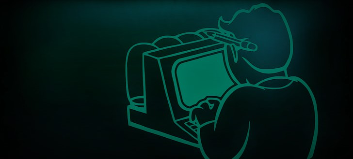

   
   <h3 align="center">¡Hey 👋! Soy napzalav! 👨🏻‍💻</h3>

# Hey! Soy Cesar! 👋

Soy Full Stack Developer & Tester QA 
 

## 👾 Stack Frontend
Javascript, HTML, CSS, Angular, Botstrap

## 🧬 Stack Backend
Java, PHP, MySQL, Firebase

## 🧪 Skills Testing
JIRA, Postman, Selenium, JMETER

## 📌 Documentación que consulto y tal vez te sirva:

 - [PHP](https://www.php.net/manual/es/)
 - [W3School](https://www.w3schools.com/)

## 🔗 Encuentrame en:

## Algunos Canales de YT que me enseñaron!

 - [TodoCode](https://www.youtube.com/@TodoCode)
 - [midudev](https://www.youtube.com/@midudev)
 - [MoureDev](https://www.youtube.com/@mouredev)
 - [HolaMundo!](https://www.youtube.com/@HolaMundoDev)
 - [CodingTube](https://www.youtube.com/@CodingTube)
 - [hdeleon.net](https://www.youtube.com/@hdeleonnet)
 - [MGBComputacion](https://www.youtube.com/@MGBComputacion)
 - [Develoteca](https://www.youtube.com/@Develoteca)
